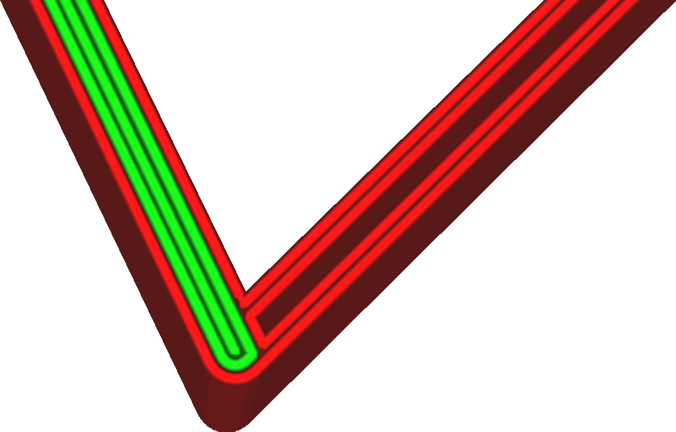

Line Width
====
This is the horizontal width of the lines that the printer will place down. Normally the diameter of the nozzle opening determines how wide your lines will be, but by extruding more or less material, the printer can vary a little bit in how wide the lines will become.

Reducing the line width allows the printer to print more details. In particular it also allows the printer to print thin parts. Line width is one of the most influential settings in your print. Here are some of the effects:
* Printing thinner lines will allow thinner pieces to be printed, since it can even fit a line in the thinnest parts.
* Adjusting the line width to an even multiple of the thickness of your print can make the object stronger and make the material flow better.
* A smaller line width will make your top surface look smoother.
* Printing lines slightly smaller than your nozzle size tends to improve strength. It allows the nozzle to fuse adjacent lines together when it makes a second pass slightly over the previous line.
* Printing lines that are too wide will lead to underextrusion. The printer will attempt to extrude more material, enough to fill the desired width of the line. That material will attempt to flow in whichever direction it can. However at some point the back pressure will become too great such that the material will no longer flow all the way to the side of the very wide lines. This then leaves gaps between the lines.
* Printing lines that are too small will also lead to underextrusion. If the material doesn't flow fast enough through the nozzle, the surface tension of the material will cause it to coagulate into small droplets, making the extrusion uneven and leaving gaps in between the droplets.
* Printing thinner lines will considerably increase the printing time.

It's not advisable to reduce the line width below 60% of the nozzle size or above 150%. Both may fail to extrude enough material.

<!--if cura_version>=5.0-->In thin parts, the line width will automatically be adjusted to make it fit the local width of the part there. There is no need to ensure that the part's width is a multiple of the line width. The [Wall Transitioning Threshold Angle](wall_transition_angle.md) determines where the line width automatically gets adjusted in sharp corners. The [Minimum Wall Line Width](min_wall_line_width.md) determines how far they can get adjusted in each direction.<!--endif-->

<!--if cura_version<5.0:
Adjusting line widths to fit enough walls
----
When printing mechanical objects that need to be thin but strong, you'll regularly run into the problem that your piece is not a clean even multiple of the line width. If it's not an even multiple, Cura will normally reduce the flow of some of the lines due to the [Compensate Wall Overlaps](travel_compensate_overlapping_walls_enabled.md) setting. This changes the flow rate through the nozzle which is detrimental to visual quality. If it is a clean multiple of the line width but not an even number, one of the walls will get reduced to 0.

Producing clean contours with even lines can make the print stronger and look better. A hallmark skill of any expert Cura user is to be able to tweak the line width such that the desired number of contours fill the print.

-->
Keeping the flow constant
----
Great fluctuations in flow are sometimes problematic for FDM printers. The nozzle chamber keeps some material under pressure, which causes the actual flow rate out the nozzle to be delayed. It'll take a while for the flow rate to increase or decrease. Printers with a Bowden system to feed the filament also have springiness in the Bowden tube, which makes the effect much worse. As a result of this, you'll get underextrusion when switching to a higher flow rate and overextrusion when switching to a lower flow rate. Therefore it is a good idea to keep the flow rate as constant as possible.

Line width influences the flow rate greatly. It is advisable to keep the widths of the lines close together and close to the size of the nozzle. If adjusting the line width significantly, you could consider adjusting the printing speed as well to keep the flow rate more constant. This will improve your print's dimensional accuracy.