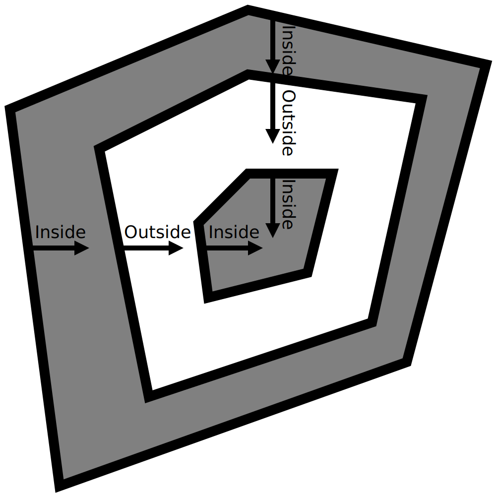
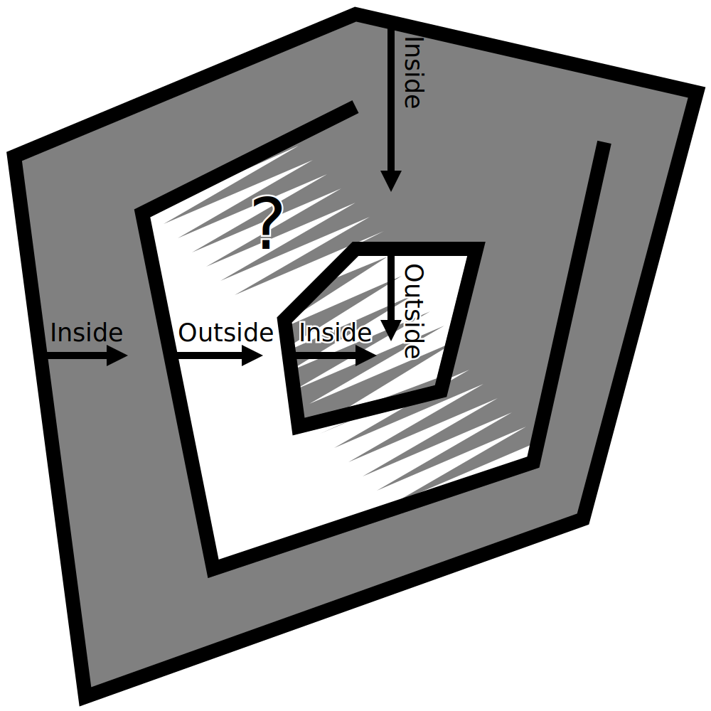
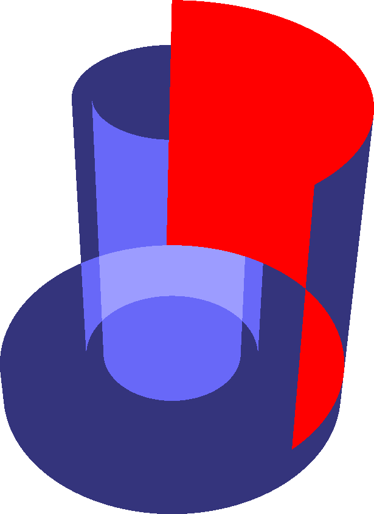

Missing Parts
====
Sometimes, when inspecting layer view (or if unlucky, while printing), it appears like some pieces of the print are missing. This can have several reasons. This article names a few possibilities.

Non-manifold meshes
----
Some meshes have holes in their surface or extra geometry on the inside. This confuses Cura, because it's no longer clear which parts of the volume belong to the inside and which parts don't. When looking at a cross-section of the model, Cura will count from the outside in. The first surface it crosses means it's going to the inside of the model. The second surface means it's going outside again. The third surface it crosses means it's going back inside, and so on. If parts of the surfaces are missing, or if there are extra loose surfaces in the middle, the inside becomes ambiguous depending on which side you're looking from.

Meshes that have such missing surfaces or extra pieces are called non-manifold since they could not exist in the real world. Cura will try to mend them by closing small gaps, but if a surface can't be mended it will be left out of the print (unless [Surface Mode](../blackmagic/magic_mesh_surface_mode.md) is set to include them). The missing or extra geometry is also displayed in the 3D scene with a spotted pattern, or in red in the Prepare stage when using the X-ray view. This will colour the surface differently if it belongs to an odd number of surfaces, which happens only when the mesh is not manifold. It helps to identify problems with your mesh. You will then need to repair those meshes in a CAD or modelling application.

While Cura normally assumes that the mesh is manifold, it can fix the model in some cases. These are some things you can try:
* [Extensive Stitching](../meshfix/meshfix_extensive_stitching.md) handles cases better where there is extra geometry attached to the outside of a model, though it takes some extra time to slice.
* [Keep Disconnected Faces](../meshfix/meshfix_keep_open_polygons.md) will close all open loops with a straight line. This will close small gaps very well. However it may also make the model look very strange if there are big gaps in it.
* As a last resort, the [Surface Mode](../blackmagic/magic_mesh_surface_mode.md) can be used to print parts with holes just as a single wall, without any content. Since it's not known where the inside of this part is, there will not be any infill or skin, but at least the outline can be drawn. In some cases this can make the print still look passable.

If these options fail to produce the desired print, you will need to repair them manually with 3D modelling applications.

Thin parts
----
If the model has very fine details, not everything can be drawn with the thick lines that come out of your 3D printer. Cura will fit lines inside of the shape outlined by your mesh. If this is not possible, nothing will be printed. In that case, it may appear as if parts of the print are missing.

There are a couple of things that can be done about this:
<!--if cura_version>=5.0-->* Enable the [Print Thin Walls](../shell/fill_outline_gaps.md) setting. This will let the printer use thinner lines to print very thin parts, although they might become wider than the model intends them to be.<!--endif-->
* Reduce the [line width](../resolution/line_width.md). If you're printing something that has thin walls or webbings, make sure that the line width is slightly smaller than the minimum width of that part. However reducing the line width too much may cause [underextrusion](underextrusion.md) due to insufficient flow. To be able to reduce the line width further, you'll need to use a smaller nozzle.
* Add some [horizontal expansion](../shell/xy_offset.md) to the print. This makes the entire model wider on all sides, including the thin parts. They become less thin that way, so that they may now be printed. This does of course also ruin any dimensional accuracy and detail of the print since everything becomes thicker.
<!--if cura_version<5.0:* Enable the [Print Thin Walls](../shell/fill_outline_gaps.md) setting. This will attempt to fill the thin parts with very small lines without reducing the line width of the rest of the model. However this does cause big changes in the flow rate of the material and may not always fill the walls with nice, even lines.-->
* Consider adjusting the model to the print, by making every piece at least as thick as your line width.