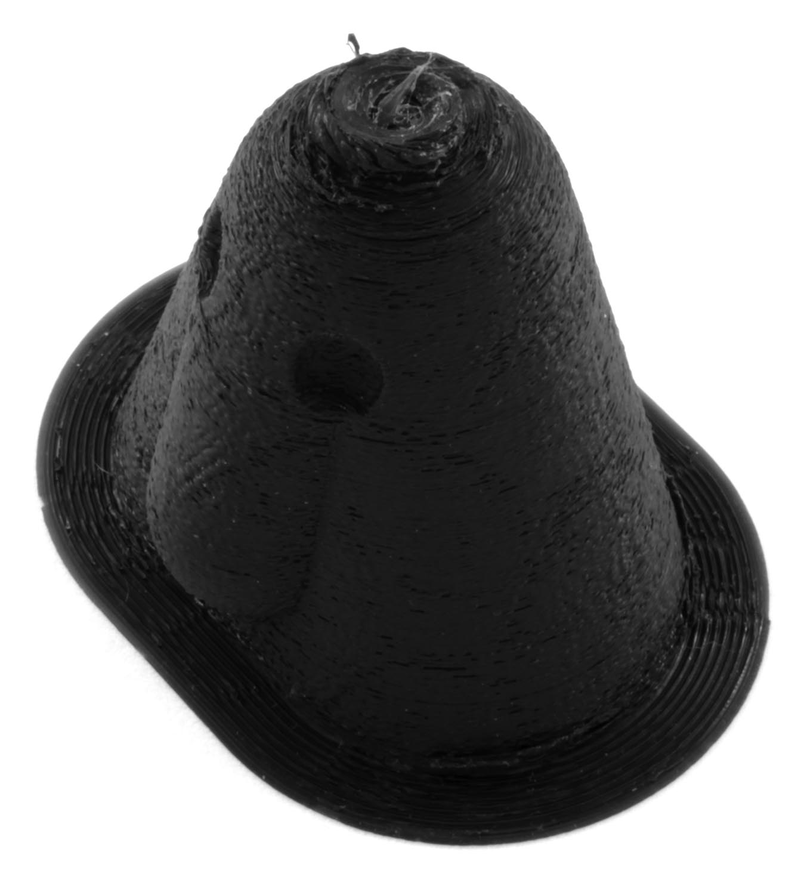

Overextrusion
====
Overextrusion is a term used when the printer extrudes too much material in one place. This causes the material to flow over to the sides or upwards, which makes the surface very rough and irregular. It can also cause [stringing](stringing.md) and lots of [blobs](blobs.md).

Temperature control
----
The most common cause of overextrusion is printing too hot. If the [printing temperature](material_print_temperature.md) is set too high, then the material will have a lower viscosity, making it flow out the nozzle without control. Typically the result is overextrusion in some areas like the outer walls, but underextrusion in others like the infill.

To remedy this you need to reduce your temperature gradually. Take a careful look at the specifications sheet of the material you're printing with to see which temperature range is acceptable and reduce your printing temperature towards the lower end of that range.

Filament diameter
----
There are several standards for filament diameters. The most common ones are 1.75mm and 2.85mm, but 3.00mm is also still around. Apart from that, not all manufacturers produce their filament with a consistent diameter. If your filament is wider than what Cura expects, you will extrude too much material, since Cura instructs the printer to extrude a certain length of filament which will have too much volume then.

To fix this, first measure the actual diameter of the filament using calipers. It is best to measure this in several spots, in case it varies, and at various angles around the circumference. Take the average of these measurements. This average can be filled into Cura in the Material Management page, as a property of the material. If the diameter can't be edited because it's a built-in material, you may need to duplicate the material first. It should then allow you to edit the diameter.

Extruder calibration
----
Sometimes the problem lies in the hardware not matching up with the expectations of the firmware. If the extruder motor is a stepper motor (which is common in 3D printers) then the firmware needs to know how many steps of the motor will result in a certain distance to be moved. The firmware has a setting for this, measuring the accuracy of the feeder in steps per millimetre. If this setting is configured wrongly, the feeder may move too fast or too slow. It is best to adjust this in the firmware if you can. However if that is impossible, the [flow rate](material_flow.md) in Cura can be adjusted to compensate. You should also compensate all of the [retraction distances](retraction_amount.md) and [speeds](retraction_speed.md) then.

<!--if cura_version<5.0:
Overlapping walls
----
Cura would normally just draw the contours of the print with a certain line width. If the walls come close together in certain places of your print, this would lead to overlapping lines. These lines become thick and produce blobs because it may put up to twice as much material as necessary there. Where there is a lot of overlap, the second line will be prevented from extruding, and so the pressure inside the nozzle chamber rises until it is expunged and produces a blob.

This can be prevented by enabling the [compensation for overlapping walls](travel_compensate_overlapping_walls_enabled.md). The extrusion of the second line will be reduced such that it extrudes just as much material as necessary to fill up the remaining space of the wall, which prevents overextrusion.

If the walls are overlapping due to the [Outer Wall Inset](wall_0_inset.md), you can try reducing that inset to prevent overextrusion. You can also try printing the [outer wall first](outer_inset_first.md). The excess material will then get pushed towards the inside of the model, where it is invisible.-->

Directly adjusting flow rate
----
If it's for the rest unknown what is causing this overextrusion, you can also directly adjust the [flow rate](material_flow.md). Reduce the flow rate until your surface appears smooth again. This can compensate for some unknown factor directly.