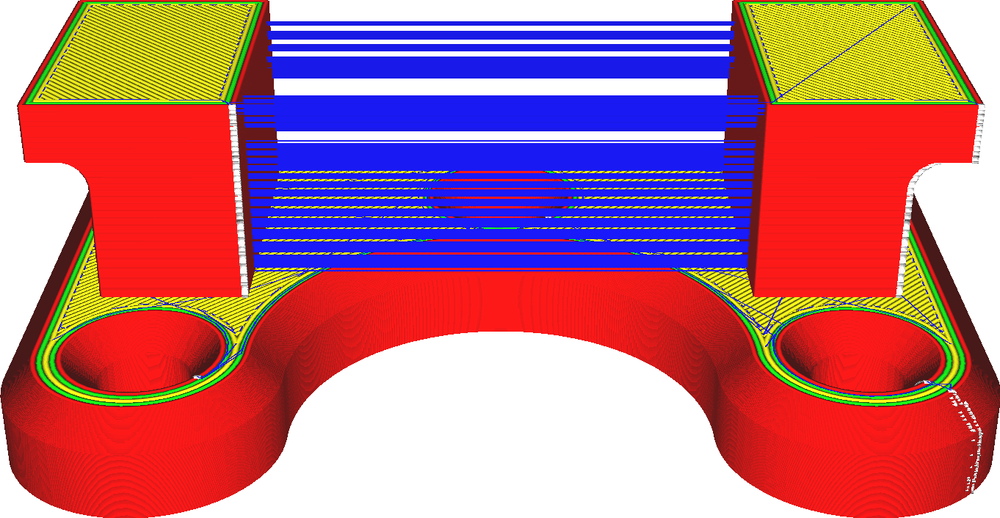

Enable Retraction
====
If a 3D printer would stop pushing material, the material won't immediately stop flowing from the end of the nozzle. There is some residual material in the nozzle and it'll be pressurised, so it keeps flowing for a while longer. To actually stop the material from flowing, the printer needs to retract the material out of the nozzle opening. This is necessary to make clean travel moves without stringing.

<!--screenshot {
"image_path": "retraction_enable_disabled.png",
"models": [{"script": "wire_mount.scad"}],
"camera_position": [0, -115, 68],
"structures": ["travels", "helpers", "shell", "infill", "starts"],
"settings": {"retraction_enable": false},
"minimum_layer": 2,
"colours": 64
}-->
<!--screenshot {
"image_path": "retraction_enable_enabled.png",
"models": [{"script": "wire_mount.scad"}],
"camera_position": [0, -115, 68],
"structures": ["travels", "helpers", "shell", "infill", "starts"],
"settings": {"retraction_enable": true},
"minimum_layer": 2,
"colours": 64
}-->

Retractions are done when a travel move is made that is particularly sensitive to stringing. Travel moves that only pass through infill or travel from support to support are normally not retracted. There is also a limit to how often the material can be retracted, through the [Maximum Retraction Count](retraction_count_max.md) and [Minimum Extrusion Distance Window](retraction_extrusion_window.md) settings.

Retracting has significant advantages, but also some disadvantages:
* It'll reduce stringing significantly. No more wiring between different parts of the print.
* It will significantly reduce the amount and size of blobs on the surface where the nozzle enters the perimeter of a part.
* It takes a bit of time to retract.
* The material flow gets interrupted when a retraction happens. This has negative consequences for dimensional accuracy, banding and underextrusion.
* The filament could wear down when too many retractions happen, preventing the feeder from gripping the material.

**Flexible materials are harder to retract, because pulling on the filament makes the filament stretch instead of pulling it out of the nozzle. It may be very time consuming and relatively ineffective to enable retraction with such materials.**