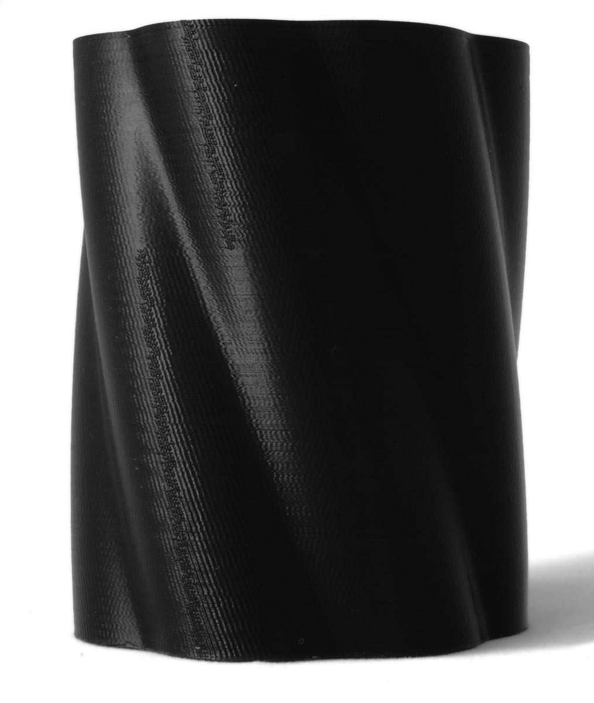

Seam
====
The walls of your print are printed as continuous loops, but the printer must start that loop somewhere and close it up nicely. If the loop is not closed nicely, a visible seam will be created. These seams are hard to remove completely, but some things can be done to hide them or reduce their size.

This should not be confused with a "Z seam", which is a seam that is being created while the nozzle moves to the height of the next layer. This movement stops the nozzle for a brief moment, creating a [blob](blobs.md) there. Cura's terminology with the seam settings is historically wrong in this regard, as its so-called "Z seam" settings are really about where to place the normal seam.

Seam placement
----
Seams are hard to prevent, but it's often pretty easy to hide the seam in a location where it's not so visible.

The primary setting to adjust the placement of the seam is the [Z Seam Alignment](../shell/z_seam_type.md). To hide the seam, place it inside the sharpest corner. With the [Seam Corner Preference](../shell/z_seam_corner.md) setting you can then choose what types of corner to select. To hide the seam, preferably you'd choose "Hide Seam" or "Smart Hiding", which place the seam in an inside corner. If your model doesn't have inside corners to hide in, you can choose "Expose Seam" to place the seam on a sharp outside corner, where it's also less visible than across an otherwise flat surface.

If the automatic placement doesn't work out well, you can also choose to place the seam yourself by choosing "User Specified". This will allow you to enter [X](../shell/z_seam_x.md) and [Y](../shell/z_seam_y.md) coordinates where the seam will be aimed at. Choose a location where the seam will not be seen.

If all else fails, you can also spread around the seam throughout the surface by selecting "Random". Instead of a continuous seam running across the part, the seam will be in random locations across the surface. The surface will be a bit pockmarked, but there is no real seam any more.

Closing the seam
----
The seam can also be made less visible by more carefully closing up the seam when it's being created. These are a few settings that can be adjusted to reduce the visibility of the seams.
* Increase the [Outer Wall Wipe Distance](../shell/wall_0_wipe_dist.md) slightly. This setting makes the nozzle continue its movement around the contour briefly after it's completed one loop. This prevents creating a gap where the contour is closed. Increasing this setting too much though may cause too much material to be deposited around where the seam is, making it visible again.
* The opposite of that is to use [coasting](../experimental/coasting_enable.md). This stops extruding material shortly before the contour is closed. This reduces the pressure inside the nozzle. The idea here is that there will not be too much overextrusion when the contour is completed, which reduces the protrusion of the seam towards the outside. As soon as the nozzle moves over the beginning of the contour, the previously placed plastic will easily block any new plastic since the pressure in the nozzle is not able to overcome the counter-pressure from the solidified wall line.
* Print the outer wall more [slowly](../speed/speed_wall_0.md). The material will be able to flow out better then to close the seam at the end.