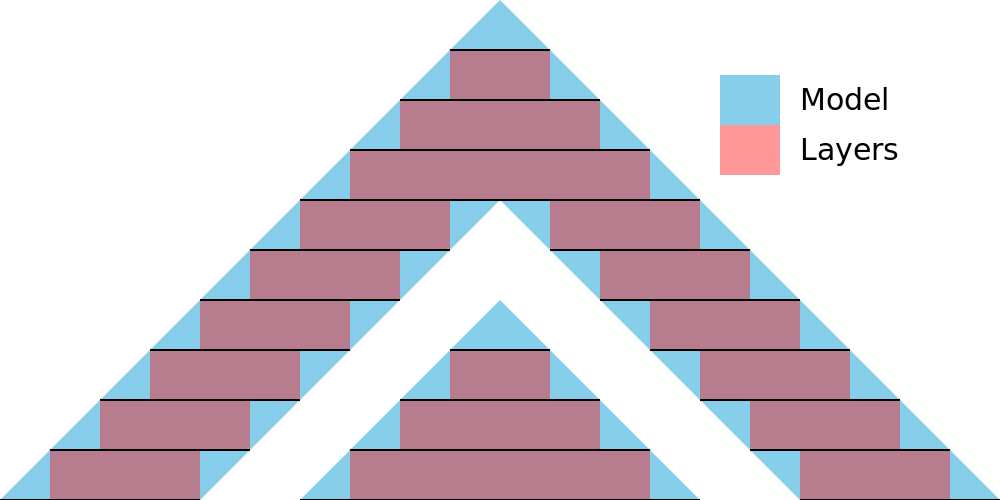

Slicing Tolerance
====
With the slicing tolerance, you can adjust how to deal with the inaccuracy of subdividing a mesh into a finite amount of layers. It allows you to choose whether the layers should closely approximate the surface, should stay bounded by the surface or should include the surface completely.

Middle
----

When using Middle, the layers will stay as close to the original surface as possible. This means that the layers will sometimes protrude outside of the original surface and sometimes dip into the original surface. Overall, the volume of the layers will match the volume of the original mesh very closely.

To get the Middle tolerance, Cura will compute a cross section halfway across each layer's thickness. Everything inside the cross section will be made part of the layer.

Inclusive
----

When using Inclusive, the layers will contain *at least* all of the original volume. Where the surface is sloped, the layers will protrude slightly. The total volume of the layers will almost always be more than the volume of the original mesh.

To get the Inclusive tolerance, Cura will compute cross sections at the top and the bottom of each layer's height. All surfaces that are in *either* of those cross sections will be taken as being part of that layer. Tiny details that fall between the two cross sections will still be ignored, being smaller than one layer height.

Exclusive
----

When using Exclusive, the layers will be contained within the original volume. Where the surface is sloped, the layers will be slightly smaller than the original volume. The total volume of the layers will almost always be less than the volume of the original mesh.

To get the Exclusive tolerance, Cura will compute cross sections at the top and the bottom of each layer's height. Only surfaces that are in *both* of those cross sections will be taken as being part of that layer.

Usage
----
This setting is named after its intended use rather than its functional effect. If you have multiple pieces that need to slide past each other, the theoretical shape of the layers may physically prevent exact fits. In such a case, you can set this setting to Exclusive so that the layers are guaranteed to stay within the bounds of the original volume. Barring warping, sagging and similar deformation effects, this would guarantee that the parts fit within each other and are able to slide past each other.

In reality there are always other effects going on that prevent this. In practice, this setting can be used to get slightly more or less tolerance between two sloped surfaces, as can be seen in the above images.