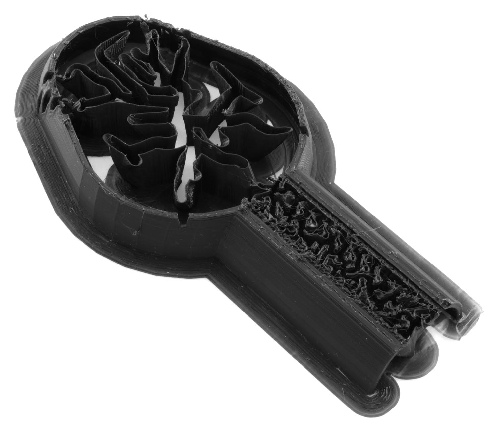

Unfinished Print
====
Sometimes a print doesn't finish completely. There could be a number of reasons why this happens, and some of them can be addressed by adjusting Cura's settings.

Printer failures
----
Sometimes the cause of an unfinished print is a printer failure, where the printer is not doing what it's expected to do. There is generally very little that Cura can do about these issues. Here are some common causes.
* Power failure. There is very little Cura can do about this, aside from printing faster to reduce the odds of a power failure during the print.
* Power supply failure. If any of the temperatures (either the [build plate](../material/material_bed_temperature.md) or the [nozzle](../material/material_print_temperature.md)) are too high, some printers have a failure mode where the power supply burns out or the temperature sensors give out errors. This will cause the printer to shut down, not finishing the print.
* Firmware freezes. Due to bugs in the firmware the printer could end up unresponsive. If you can trace where in the g-code it freezes (most often at the beginning or the end of the print) then you might be able to see what g-code is causing this. Perhaps the start g-code or the end g-code needs to be adjusted.
* The filament spool is tangled. It's a good idea to *always* hold on to the end of the filament if it's not securely in the feeder or inserted in one of the holes in the spool (if your spool has such holes). If you let go and the end of the filament jumps back onto the roll, it could slide under one of the other windings and tangle itself. Since the filament is typically hundreds of meters long, this knot can be very hard to unwind if it gets in.

Filament grinding
----
The feeder sometimes pushes very hard on the filament to push it through the extruder train. This damages the filament. When the feeder pushes and pulls on the same bit of filament very often, it can damage so much that the feeder can't get any grip on the filament any more. The material will stop flowing then and the rest of the print will be printed in air rather than plastic.

You can feel that this is happening during the print by placing a finger at the opening where the filament goes into the feeder. During a print, you should feel it move. If it doesn't move, it's most likely ground the material and doesn't get any grip on it. You can also pull the filament out of the printer and see where it is damaged.

To prevent this issue, you can make the following adjustments to Cura's settings:
* Reduce the [Maximum Retraction Count](../travel/retraction_count_max.md) or increase the [Minimum Extrusion Distance Window](../travel/retraction_extrusion_window.md). This will limit the number of retractions made during the extrusion of a given length of filament. In effect this limits how often the feeder can roll back and forth across each piece of filament.
* Reduce the [Retraction Distance](../travel/retraction_amount.md). Again this will limit the number of times the feeder goes back and forth across the same bit of filament.
* Reduce the [Retraction Speed](../travel/retraction_speed.md). If the material is moving fast but is obstructed anywhere along the way, the feeder will grind the material. If the material is moving slower, there is less chance of this happening.
* Print slower, by reducing the [Layer Height](../resolution/layer_height.md), the [Line Width](../resolution/line_width.md) or the [speeds](../speed/speed_print.md). This reduces the force that the feeder needs to put out on the filament, reducing the chance of grinding.