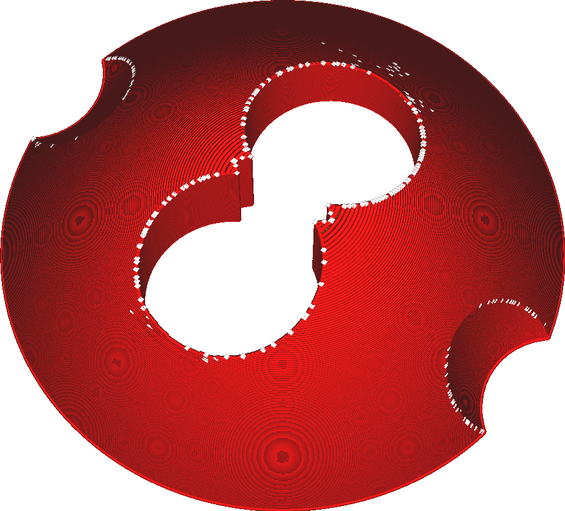

Z Seam Alignment
====
This setting allows you to choose where the seam of each contour is placed. Several options are available that give great control over where the seam gets placed to minimise its impact or to allow you to remove the seam more easily in post-processing.

The seam is where the contour starts and ends printing. Even if the path of the nozzle is a closed circle, a seam is still left where the extrusion starts and ends because the printing process is never completely accurate. With this setting the visibility of the seam can be minimised by hiding it somewhere or spreading it around.

<!--screenshot {
"image_path": "z_seam_type_user.png",
"models": [{"script": "seams_on_curves.scad"}],
"camera_position": [51, -36, 132],
"settings": {
    "z_seam_corner": "z_seam_corner_outer",
    "z_seam_position": "left",
    "z_seam_type": "back"
},
"colours": 32
}-->
User specified
----

This option allows you to choose a location manually. The seam will be placed in the corner that is closest to the chosen location. This will usually line up the corners very closely together, which allows you to cut away the seam easily. It also allows fine-grained control over where the seam should be.

By default a location in the back of the printer is chosen. The idea is that users mostly let the front part of their models face the front side of the printer, so a location in the back will hide the seam better.

<!--screenshot {
"image_path": "z_seam_type_shortest.png",
"models": [{"script": "seams_on_curves.scad"}],
"camera_position": [51, -36, 132],
"settings": {
    "z_seam_corner": "z_seam_corner_outer",
    "z_seam_type": "shortest"
},
"colours": 32
}-->
Shortest
----

This option simply minimises the length of travel moves leading towards the seam, making no effort to place it anywhere in particular. Because the travel path is shorter, you'll save a small measure of time on travel moves. The seam will also be slightly smaller, because less ooze will be placed in the location where the nozzle lands on the contour.

The desired corner preference is still held by picking a corner close to where the nozzle is. Not the very closest corner is chosen, but a weighted preference is used to minimise travel moves somewhat but also use an appropriate corner for the [Seam Corner Preference](z_seam_corner.md) setting.

<!--screenshot {
"image_path": "z_seam_type_random.png",
"models": [{"script": "seams_on_curves.scad"}],
"camera_position": [51, -36, 132],
"settings": {
    "z_seam_corner": "z_seam_corner_outer",
    "z_seam_type": "random"
},
"colours": 32
}-->
Random
----

A random location around the perimeter is chosen for the seam. This random location is changed in every layer, so the seam will get spread out pretty much evenly around the model. Because the seams of different layers don't line up, the seam will hardly be visible. However, the surface will look altogether slightly messier.

<!--screenshot {
"image_path": "z_seam_type_sharpest.png",
"models": [{"script": "seams_on_curves.scad"}],
"camera_position": [51, -36, 132],
"settings": {
    "z_seam_corner": "z_seam_corner_outer",
    "z_seam_type": "sharpest_corner"
},
"colours": 32
}-->
Sharpest corner
----

The seam will be placed in the very sharpest corner of the whole contour, according to the corner preference chosen in the [Seam Corner Preference](z_seam_corner.md) setting. This may incur longer travel moves, but ensures that the seam is hidden or exposed maximally according to the preference set for the corners.